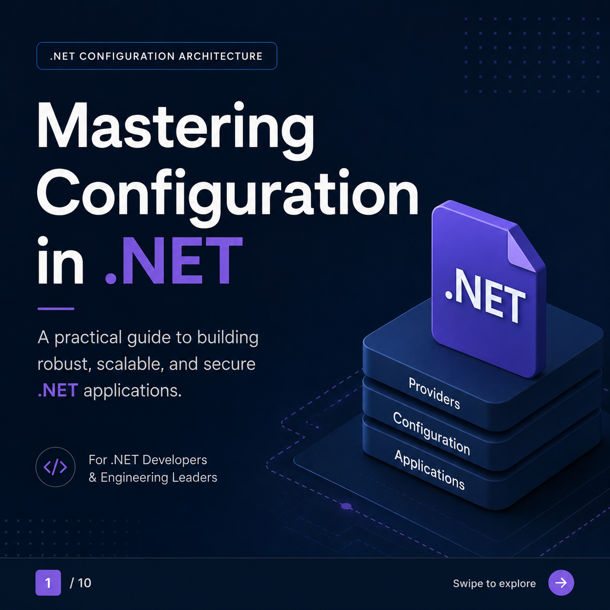
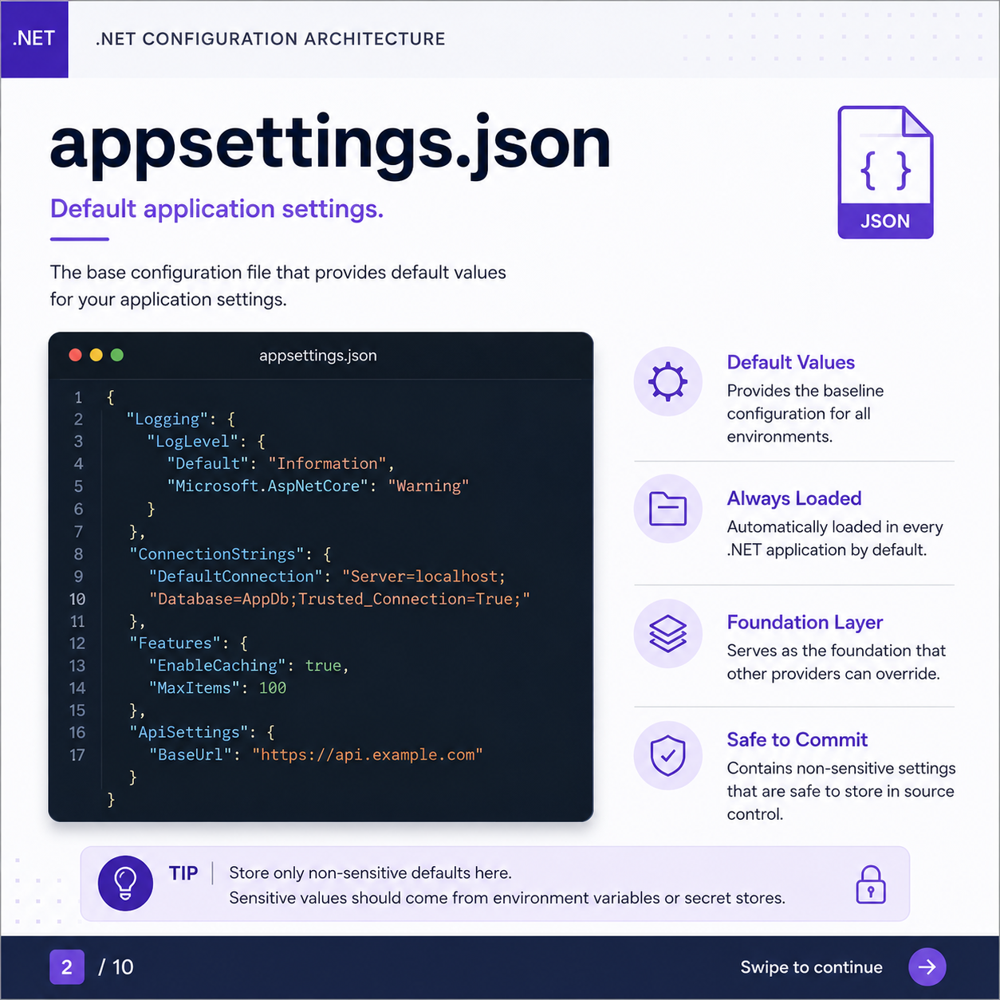
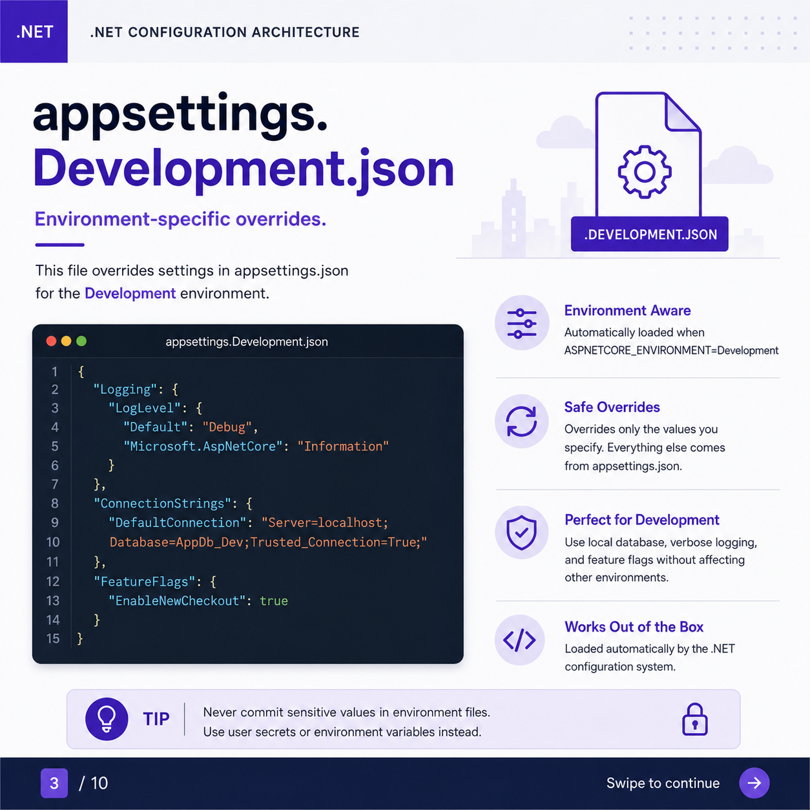
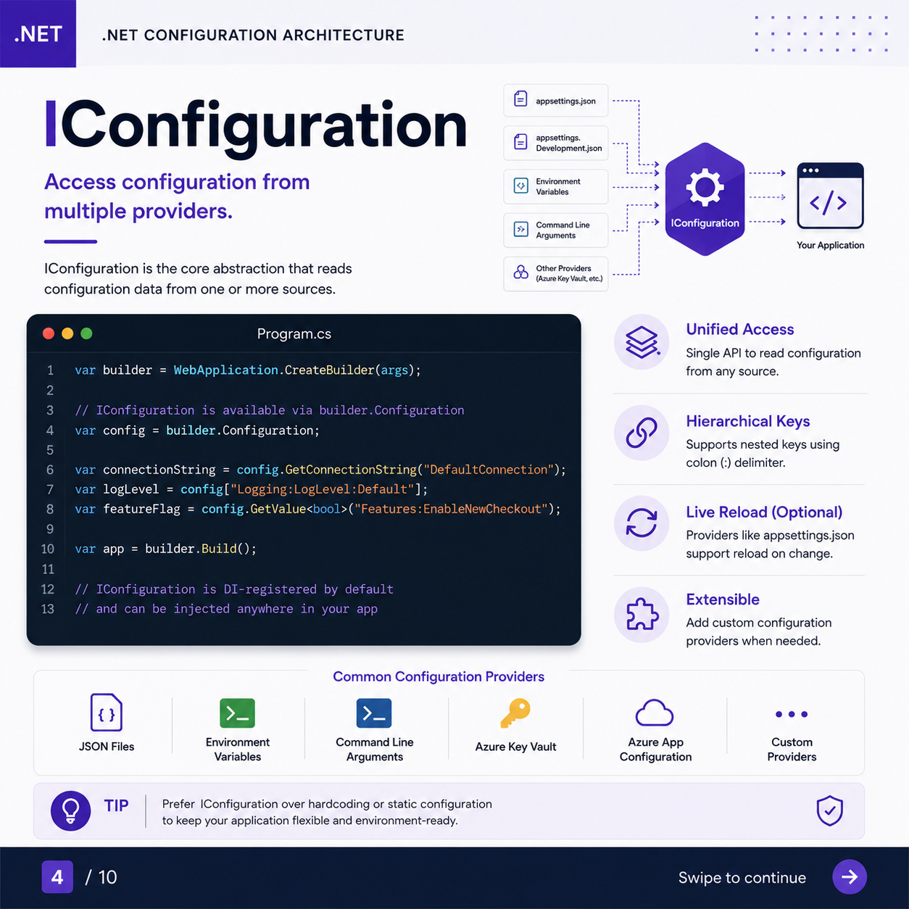
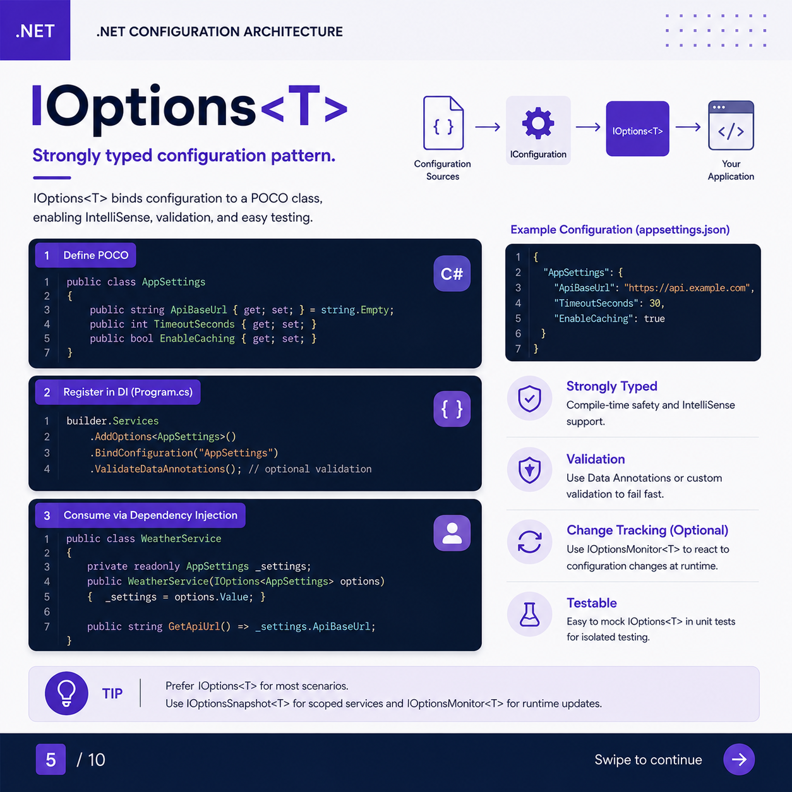
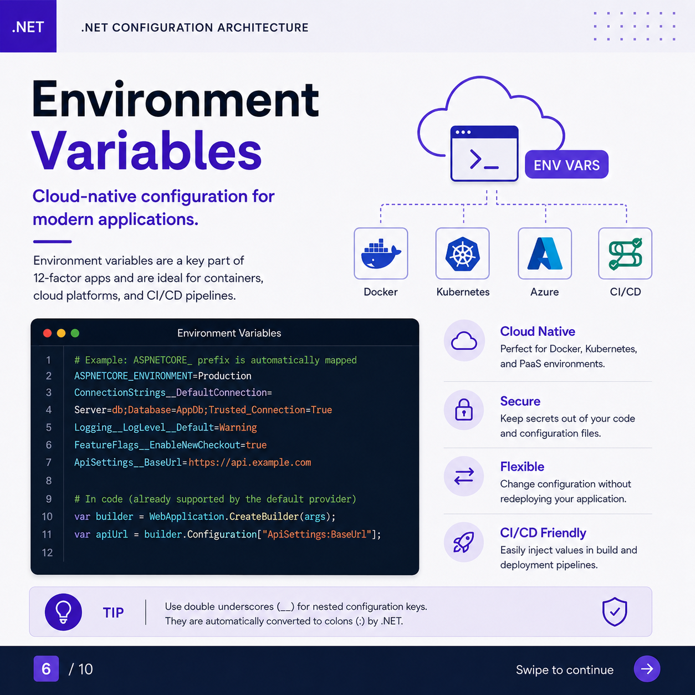
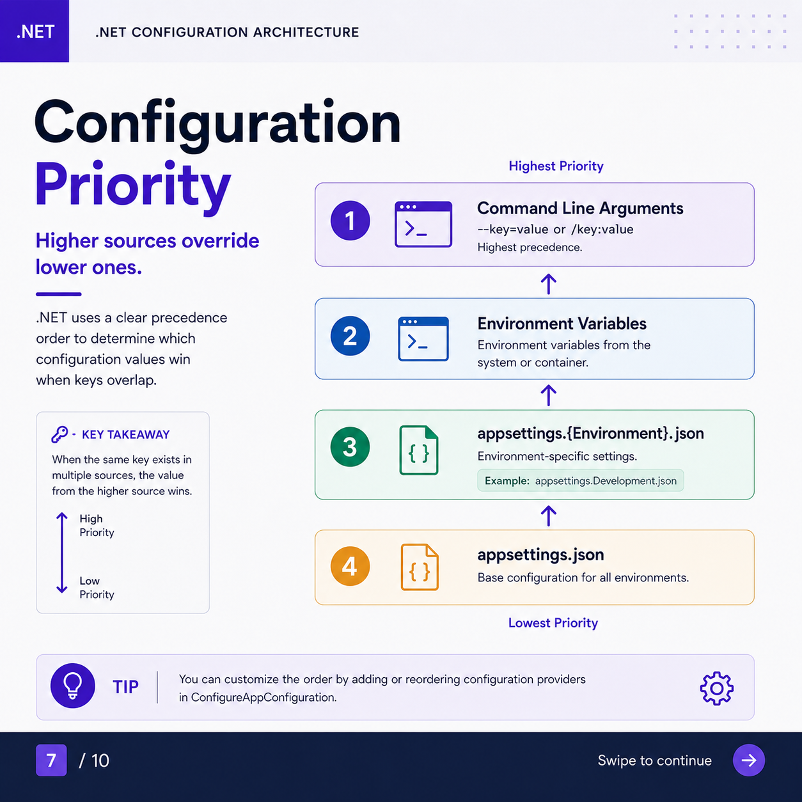
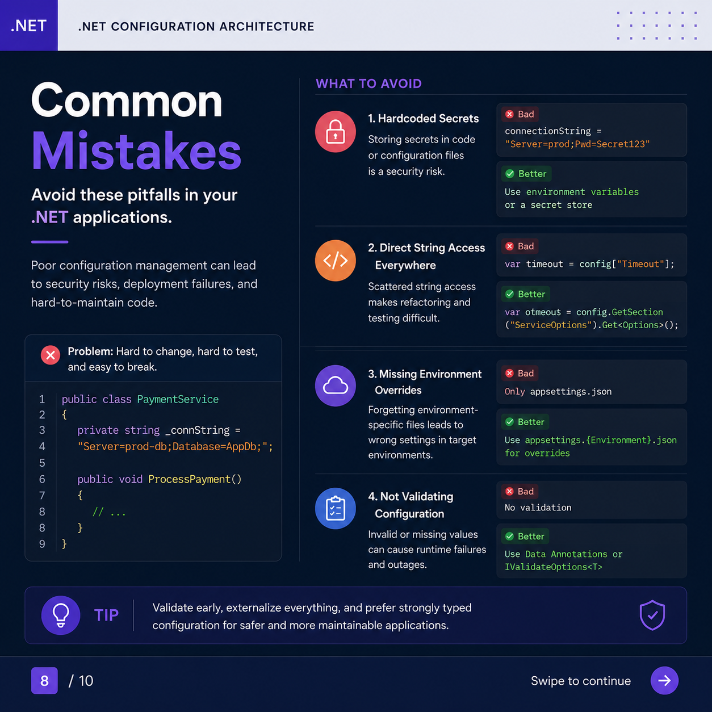
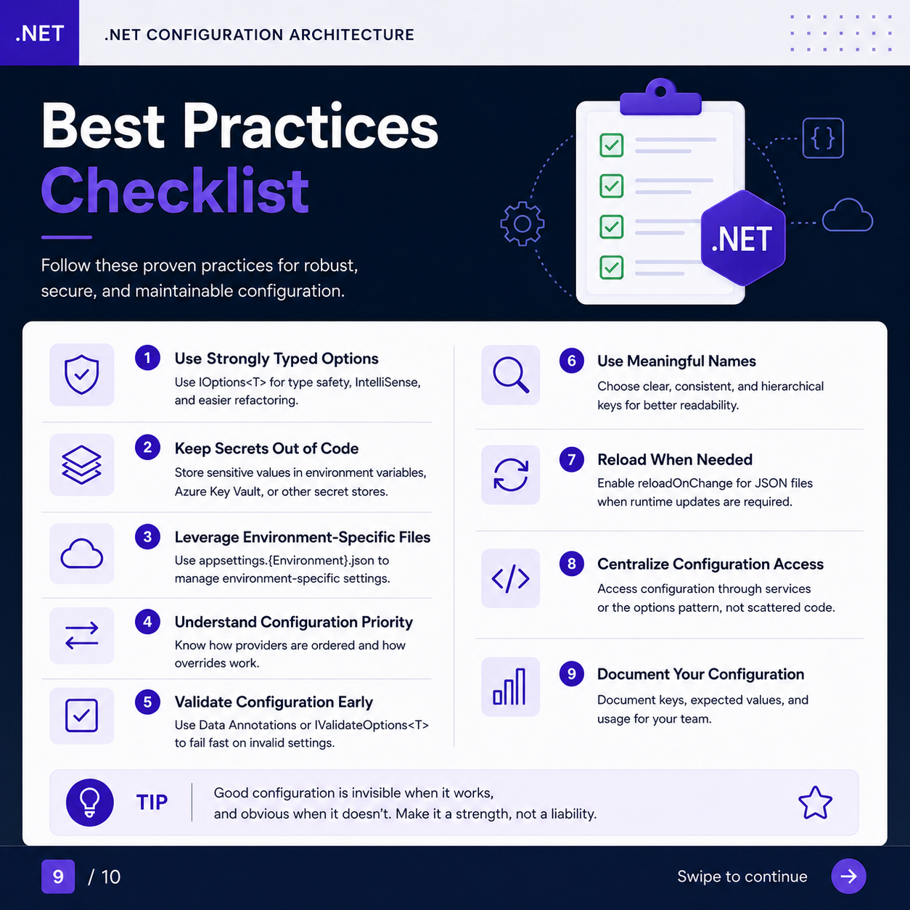
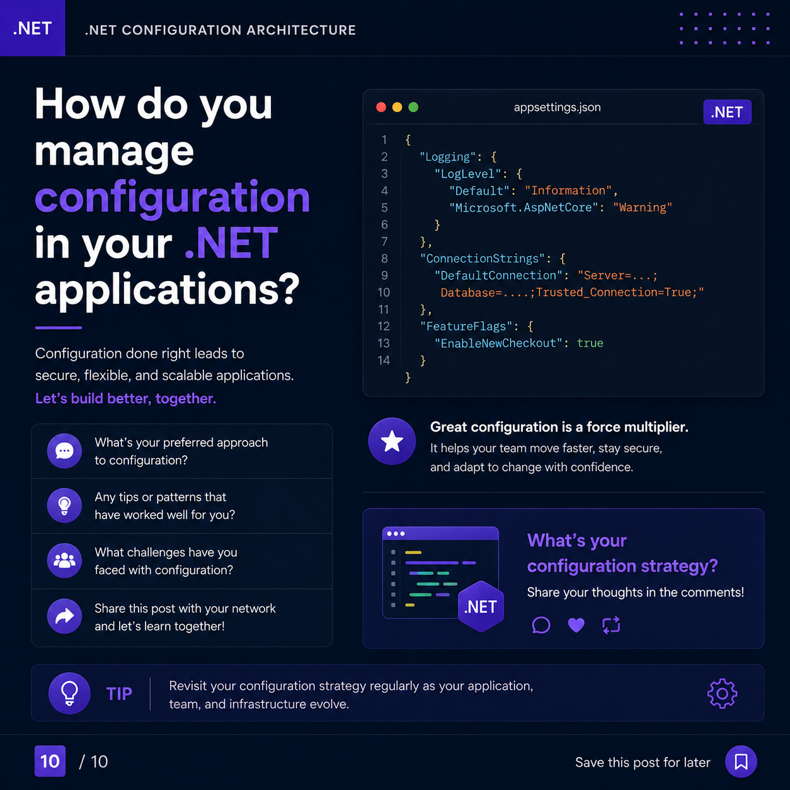

# Mastering Configuration in .NET

<details>
  <summary>📸 Click here to expand and view the PDF document</summary>
  
  
  
  
  
  
  
  
  
  
  
</details>

## 1. Project Setup

### Prerequisites

- [.NET SDK 8+](https://dotnet.microsoft.com/download)
- Any IDE: Visual Studio, VS Code, or Rider

### Create a new Web API project

```bash
dotnet new webapi -n MyApp
cd MyApp
dotnet run
```

The project template already includes the full configuration pipeline out of the box. No extra packages are needed for `appsettings.json`, `IConfiguration`, or `IOptions<T>`.

---

## 2. `appsettings.json` — Default Settings

The **base configuration file** that provides default values for all environments. It is automatically loaded in every .NET application.

### What to write

```json
{
  "Logging": {
    "LogLevel": {
      "Default": "Information",
      "Microsoft.AspNetCore": "Warning"
    }
  },
  "ConnectionStrings": {
    "DefaultConnection": "Server=localhost;Database=AppDb;Trusted_Connection=True;"
  },
  "Features": {
    "EnableCaching": true,
    "MaxItems": 100
  },
  "AppSettings": {
    "ApiBaseUrl": "https://api.example.com",
    "TimeoutSeconds": 30,
    "EnableCaching": true
  }
}
```

### Key characteristics

| Property | Description |
|---|---|
| **Default Values** | Provides baseline config for all environments |
| **Always Loaded** | Automatically loaded in every .NET app |
| **Foundation Layer** | Acts as the base that other providers can override |
| **Safe to Commit** | Contains only non-sensitive settings |

> **Tip:** Store only non-sensitive defaults here. Sensitive values (passwords, API keys, secrets) should come from environment variables or secret stores like Azure Key Vault.

---

## 3. `appsettings.Development.json` — Environment Overrides

This file **overrides** values from `appsettings.json` specifically for the `Development` environment. It is loaded automatically when `ASPNETCORE_ENVIRONMENT=Development`.

### What to write

```json
{
  "Logging": {
    "LogLevel": {
      "Default": "Debug",
      "Microsoft.AspNetCore": "Information"
    }
  },
  "ConnectionStrings": {
    "DefaultConnection": "Server=localhost;Database=AppDb_Dev;Trusted_Connection=True;"
  },
  "FeatureFlags": {
    "EnableNewCheckout": true
  }
}
```

### Key characteristics

| Property | Description |
|---|---|
| **Environment Aware** | Auto-loaded when `ASPNETCORE_ENVIRONMENT=Development` |
| **Safe Overrides** | Only overrides keys you specify; rest comes from `appsettings.json` |
| **Perfect for Dev** | Use local DB, verbose logging, and feature flags without affecting other environments |
| **Works Out of the Box** | Loaded automatically by the .NET configuration system |

> **Tip:** Never commit sensitive values in environment files. Use **User Secrets** (`dotnet user-secrets`) or environment variables instead.

### Setting up User Secrets for local development

```bash
dotnet user-secrets init
dotnet user-secrets set "ConnectionStrings:DefaultConnection" "your-secret-connection-string"
```

---

## 4. `IConfiguration` — Unified Access

`IConfiguration` is the **core abstraction** that reads configuration data from one or more sources through a single API.

### How it works

Multiple providers (JSON files, env vars, CLI args, Azure Key Vault, etc.) all feed into a single `IConfiguration` instance that your application consumes.

```
appsettings.json  ─┐
appsettings.*.json ┤
Environment Vars  ─┼──► IConfiguration ──► Your Application
Command Line Args ─┤
Other Providers   ─┘
```

### What to write in `Program.cs`

```csharp
var builder = WebApplication.CreateBuilder(args);

// IConfiguration is available via builder.Configuration
var config = builder.Configuration;

// Access values using string keys (colon : as delimiter for nested keys)
var connectionString = config.GetConnectionString("DefaultConnection");
var logLevel        = config["Logging:LogLevel:Default"];
var featureFlag     = config.GetValue<bool>("Features:EnableCaching");

var app = builder.Build();
// IConfiguration is DI-registered by default and can be injected anywhere
```

### Injecting IConfiguration into a service

```csharp
public class MyService
{
    private readonly IConfiguration _config;

    public MyService(IConfiguration config)
    {
        _config = config;
    }

    public string GetApiUrl() => _config["AppSettings:ApiBaseUrl"] ?? string.Empty;
}
```

### Key characteristics

| Property | Description |
|---|---|
| **Unified Access** | Single API to read config from any source |
| **Hierarchical Keys** | Supports nested keys using colon `:` delimiter |
| **Live Reload (Optional)** | Providers like `appsettings.json` support reload on change |
| **Extensible** | Add custom configuration providers when needed |

> **Tip:** Prefer `IConfiguration` over hardcoding or static configuration to keep your application flexible and environment-ready.

---

## 5. `IOptions<T>` — Strongly Typed Configuration

`IOptions<T>` binds configuration to a **POCO class**, enabling IntelliSense, validation, and easy testing. This is the recommended approach for most scenarios.

### Step 1 — Define a POCO class

```csharp
// AppSettings.cs
public class AppSettings
{
    public string ApiBaseUrl { get; set; } = string.Empty;
    public int    TimeoutSeconds { get; set; }
    public bool   EnableCaching { get; set; }
}
```

### Step 2 — Register in DI (`Program.cs`)

```csharp
builder.Services
    .AddOptions<AppSettings>()
    .BindConfiguration("AppSettings")       // matches the key in appsettings.json
    .ValidateDataAnnotations()              // optional: fail fast on invalid values
    .ValidateOnStart();                     // optional: validate at startup
```

### Step 3 — Consume via Dependency Injection

```csharp
public class WeatherService
{
    private readonly AppSettings _settings;

    public WeatherService(IOptions<AppSettings> options)
    {
        _settings = options.Value;
    }

    public string GetApiUrl() => _settings.ApiBaseUrl;
}
```

### Adding validation with Data Annotations

```csharp
using System.ComponentModel.DataAnnotations;

public class AppSettings
{
    [Required]
    [Url]
    public string ApiBaseUrl { get; set; } = string.Empty;

    [Range(1, 300)]
    public int TimeoutSeconds { get; set; }

    public bool EnableCaching { get; set; }
}
```

### Variants of IOptions

| Interface | Use Case |
|---|---|
| `IOptions<T>` | Singleton — value is set once at startup. Use for most scenarios. |
| `IOptionsSnapshot<T>` | Scoped — re-evaluated per request. Use for scoped services. |
| `IOptionsMonitor<T>` | Singleton — reacts to live config changes at runtime. |

> **Tip:** Prefer `IOptions<T>` for most scenarios. Use `IOptionsSnapshot<T>` for scoped services and `IOptionsMonitor<T>` for runtime updates.

---

## 6. Environment Variables — Cloud-Native Config

Environment variables are a key part of **12-factor apps** and are ideal for containers, cloud platforms, and CI/CD pipelines.

### Naming convention

Use **double underscores `__`** for nested configuration keys. .NET automatically converts them to colons `:`.

```bash
# These map directly to the appsettings.json structure:
ASPNETCORE_ENVIRONMENT=Production
ConnectionStrings__DefaultConnection=Server=db;Database=AppDb;Trusted_Connection=True
Logging__LogLevel__Default=Warning
FeatureFlags__EnableNewCheckout=true
AppSettings__ApiBaseUrl=https://api.example.com
AppSettings__TimeoutSeconds=60
```

### Reading env vars in code (already supported by default)

```csharp
var builder = WebApplication.CreateBuilder(args);

// No extra setup needed — environment variables are read automatically
var apiUrl = builder.Configuration["AppSettings:ApiBaseUrl"];
```

### Setting environment variables

**Linux / macOS:**
```bash
export ASPNETCORE_ENVIRONMENT=Production
export AppSettings__ApiBaseUrl=https://api.example.com
dotnet run
```

**Windows (PowerShell):**
```powershell
$env:ASPNETCORE_ENVIRONMENT = "Production"
$env:AppSettings__ApiBaseUrl = "https://api.example.com"
dotnet run
```

**Docker:**
```dockerfile
ENV ASPNETCORE_ENVIRONMENT=Production
ENV AppSettings__ApiBaseUrl=https://api.example.com
```

**Docker Compose:**
```yaml
services:
  myapp:
    image: myapp:latest
    environment:
      - ASPNETCORE_ENVIRONMENT=Production
      - ConnectionStrings__DefaultConnection=Server=db;Database=AppDb;Trusted_Connection=True
      - AppSettings__ApiBaseUrl=https://api.example.com
```

**Kubernetes (env in pod spec):**
```yaml
env:
  - name: ASPNETCORE_ENVIRONMENT
    value: "Production"
  - name: AppSettings__ApiBaseUrl
    valueFrom:
      secretKeyRef:
        name: app-secrets
        key: api-base-url
```

### Key characteristics

| Property | Description |
|---|---|
| **Cloud Native** | Perfect for Docker, Kubernetes, and PaaS environments |
| **Secure** | Keeps secrets out of your code and config files |
| **Flexible** | Change configuration without redeploying your application |
| **CI/CD Friendly** | Easily inject values in build and deployment pipelines |

> **Tip:** Use double underscores `__` for nested configuration keys. They are automatically converted to colons `:` by .NET.

---

## 7. Configuration Priority Order

.NET uses a clear **precedence order** to determine which value wins when the same key appears in multiple sources.

```
┌─────────────────────────────────────────────┐  ◄ Highest Priority
│  1. Command Line Arguments                  │
│     --key=value  or  /key:value             │
├─────────────────────────────────────────────┤
│  2. Environment Variables                   │
│     System or container env vars            │
├─────────────────────────────────────────────┤
│  3. appsettings.{Environment}.json          │
│     e.g. appsettings.Development.json       │
├─────────────────────────────────────────────┤
│  4. appsettings.json                        │
│     Base configuration for all environments │
└─────────────────────────────────────────────┘  ◄ Lowest Priority
```

**Key takeaway:** When the same key exists in multiple sources, the value from the **higher source wins**.

> **Tip:** You can customize the order by adding or reordering configuration providers in `ConfigureAppConfiguration`.

### Custom provider order example

```csharp
var builder = WebApplication.CreateBuilder(args);

builder.Host.ConfigureAppConfiguration((context, config) =>
{
    config.Sources.Clear(); // Remove defaults if needed

    config.AddJsonFile("appsettings.json", optional: false, reloadOnChange: true);
    config.AddJsonFile($"appsettings.{context.HostingEnvironment.EnvironmentName}.json",
                       optional: true, reloadOnChange: true);
    config.AddEnvironmentVariables();
    config.AddCommandLine(args);
    // Add Azure Key Vault, AWS Secrets Manager, etc. here
});
```

---

## 8. Common Mistakes to Avoid

| Mistake | Problem | Fix |
|---|---|---|
| **Hardcoded Secrets** | Security risk — secrets in source control | Use environment variables or a secret store |
| **Direct String Access Everywhere** | Scattered `config["Key"]` makes refactoring hard | Use `IOptions<T>` with a POCO class |
| **Missing Environment Overrides** | Wrong settings in target environments | Use `appsettings.{Environment}.json` |
| **No Configuration Validation** | Invalid values cause runtime failures | Use Data Annotations or `IValidateOptions<T>` |

### Bad vs Good examples

```csharp
// ❌ BAD — hardcoded secret
private string _connString = "Server=prod-db;Database=AppDb;Pwd=Secret123";

// ✅ GOOD — from environment variable or secret store
private readonly string _connString;
public PaymentService(IConfiguration config)
{
    _connString = config.GetConnectionString("DefaultConnection")!;
}
```

```csharp
// ❌ BAD — scattered string access
var timeout = config["Timeout"];

// ✅ GOOD — strongly typed via IOptions<T>
var timeout = config.GetSection("ServiceOptions").Get<ServiceOptions>()!.TimeoutSeconds;
```

> **Tip:** Validate early, externalize everything, and prefer strongly typed configuration for safer and more maintainable applications.

---

## 9. Best Practices Checklist

- [ ] **Use Strongly Typed Options** — Use `IOptions<T>` for type safety, IntelliSense, and easier refactoring
- [ ] **Keep Secrets Out of Code** — Store sensitive values in environment variables, Azure Key Vault, or other secret stores
- [ ] **Leverage Environment-Specific Files** — Use `appsettings.{Environment}.json` to manage environment-specific settings
- [ ] **Understand Configuration Priority** — Know how providers are ordered and how overrides work
- [ ] **Validate Configuration Early** — Use Data Annotations or `IValidateOptions<T>` to fail fast on invalid settings
- [ ] **Use Meaningful Names** — Choose clear, consistent, and hierarchical keys for better readability
- [ ] **Reload When Needed** — Enable `reloadOnChange: true` for JSON files when runtime updates are required
- [ ] **Centralize Configuration Access** — Access configuration through services or the options pattern, not scattered code
- [ ] **Document Your Configuration** — Document keys, expected values, and usage for your team

---

> **Final Tip:** Good configuration is invisible when it works, and obvious when it doesn't. Make it a strength, not a liability. Revisit your configuration strategy regularly as your application, team, and infrastructure evolve.