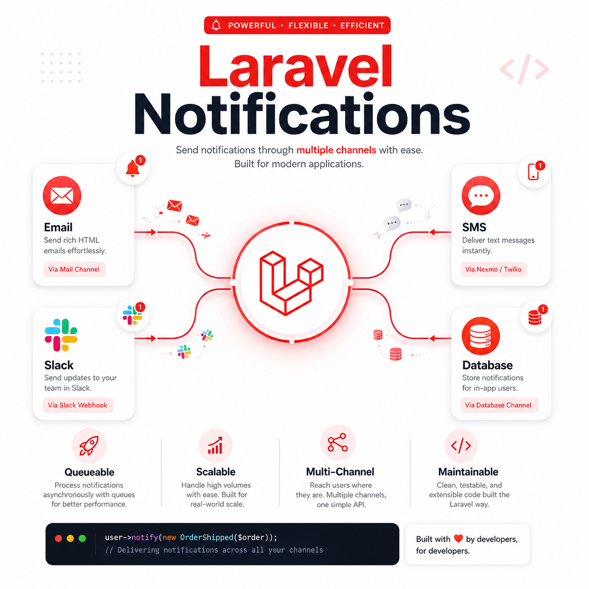
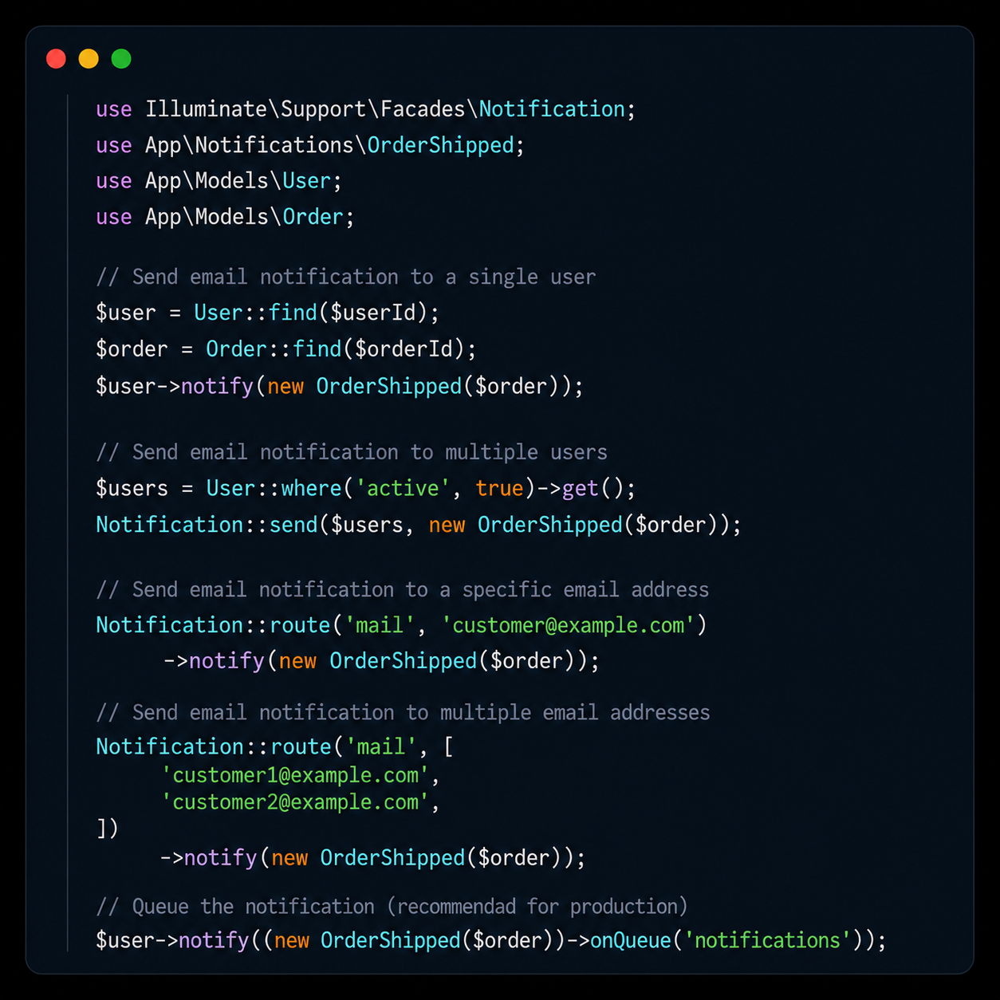
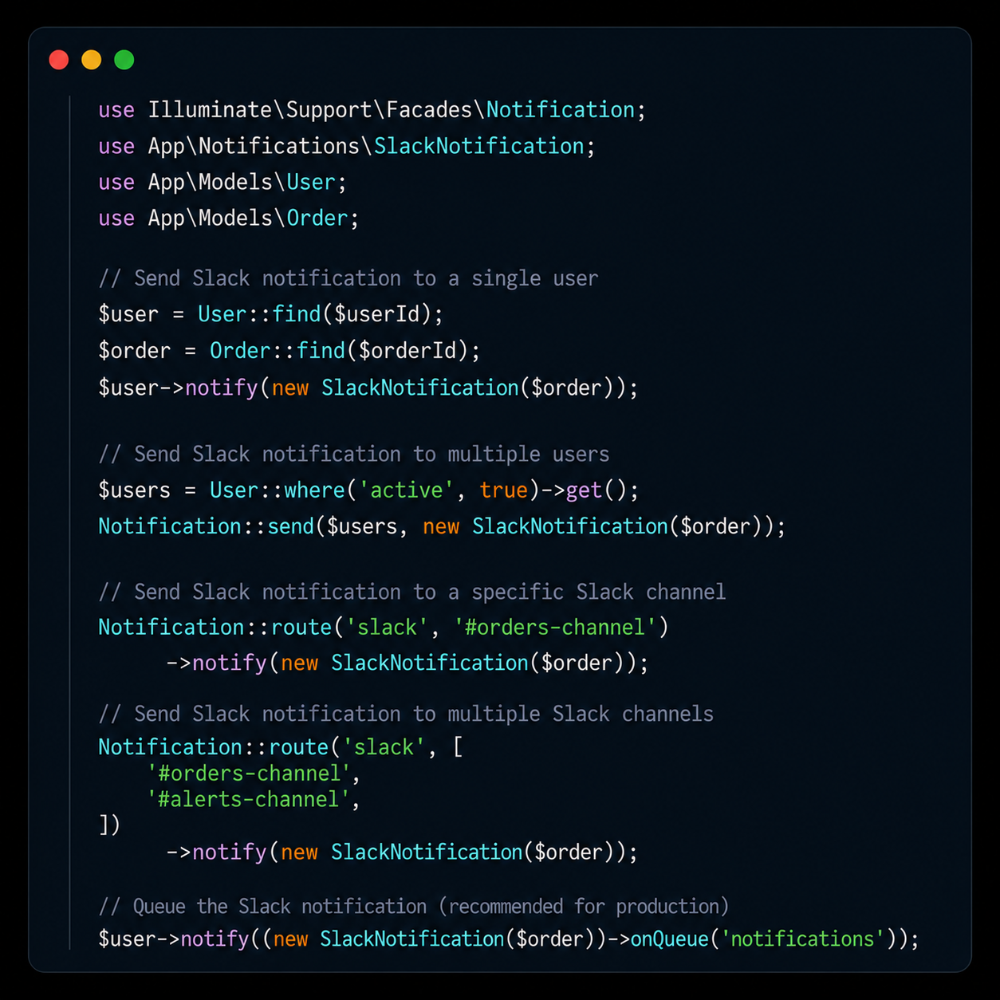
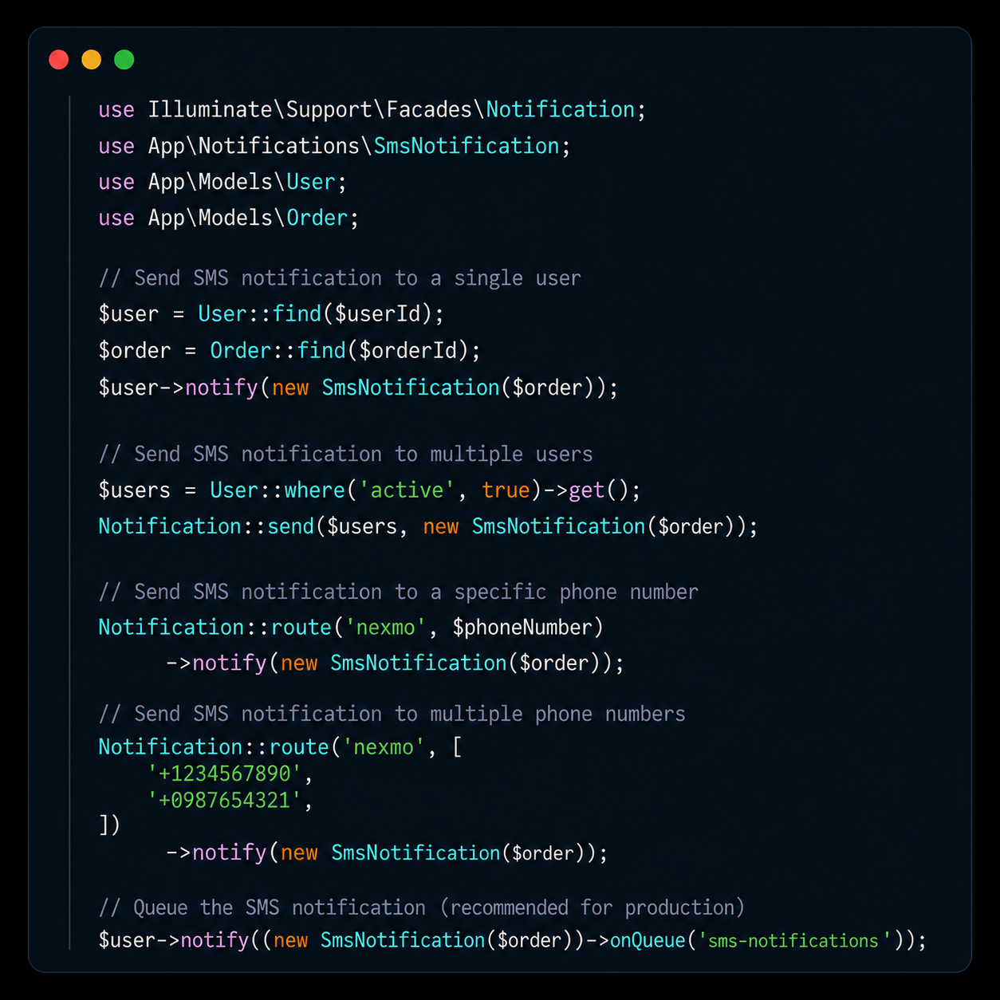

# Laravel Notifications — Email, Slack & SMS

<details>
  <summary>📸 Click here to expand and view the PDF document</summary>
  
  
  
  
  
</details>

## Requirements

- PHP >= 8.1
- Composer
- Laravel 10+
- A mail service account (Mailtrap, SendGrid, Mailgun, etc.)
- A Slack Webhook URL
- A Vonage (Nexmo) / Twilio account for SMS

---

## Create a New Laravel Project

```bash
composer create-project laravel/laravel laravel-notifications
cd laravel-notifications
```

---

## Install Dependencies

### Slack

```bash
composer require laravel/slack-notification-channel
```

### SMS (Vonage / Nexmo)

```bash
composer require laravel/vonage-notification-channel guzzlehttp/guzzle
```

### SMS (Twilio — alternative)

```bash
composer require laravel/twilio-notification-channel
```

---

## Environment Configuration

Add the following variables to your `.env` file:

```env
# ─── Mail ────────────────────────────────────────────────
MAIL_MAILER=smtp
MAIL_HOST=sandbox.smtp.mailtrap.io
MAIL_PORT=2525
MAIL_USERNAME=your_mailtrap_username
MAIL_PASSWORD=your_mailtrap_password
MAIL_ENCRYPTION=tls
MAIL_FROM_ADDRESS=hello@example.com
MAIL_FROM_NAME="${APP_NAME}"

# ─── Slack ───────────────────────────────────────────────
SLACK_WEBHOOK_URL=https://hooks.slack.com/services/YOUR/WEBHOOK/URL

# ─── Vonage (SMS) ────────────────────────────────────────
VONAGE_KEY=your_vonage_key
VONAGE_SECRET=your_vonage_secret
VONAGE_SMS_FROM=your_phone_number_or_brand
```

---

## Create a Notification Class

Laravel provides an Artisan command to scaffold a notification:

```bash
php artisan make:notification OrderShipped
```

This creates the file `app/Notifications/OrderShipped.php`.

---

## Email Notifications

Edit `app/Notifications/OrderShipped.php`:

```php
<?php

namespace App\Notifications;

use Illuminate\Bus\Queueable;
use Illuminate\Notifications\Notification;
use Illuminate\Notifications\Messages\MailMessage;

class OrderShipped extends Notification
{
    use Queueable;

    public function __construct(public $order) {}

    // Define which channels to use
    public function via(object $notifiable): array
    {
        return ['mail'];
    }

    // Build the email message
    public function toMail(object $notifiable): MailMessage
    {
        return (new MailMessage)
            ->subject('Your Order Has Been Shipped!')
            ->greeting('Hello ' . $notifiable->name . '!')
            ->line('Your order #' . $this->order->id . ' has been shipped.')
            ->action('Track Order', url('/orders/' . $this->order->id))
            ->line('Thank you for shopping with us!');
    }
}
```

---

## Slack Notifications

Create a dedicated Slack notification or extend the existing one:

```bash
php artisan make:notification SlackNotification
```

Edit `app/Notifications/SlackNotification.php`:

```php
<?php

namespace App\Notifications;

use Illuminate\Bus\Queueable;
use Illuminate\Notifications\Notification;
use Illuminate\Notifications\Messages\SlackMessage;

class SlackNotification extends Notification
{
    use Queueable;

    public function __construct(public $order) {}

    public function via(object $notifiable): array
    {
        return ['slack'];
    }

    public function toSlack(object $notifiable): SlackMessage
    {
        return (new SlackMessage)
            ->success()
            ->content('Order #' . $this->order->id . ' has been shipped!')
            ->attachment(function ($attachment) {
                $attachment->title('Order Details', url('/orders/' . $this->order->id))
                           ->fields([
                               'Order ID'  => $this->order->id,
                               'Status'    => 'Shipped',
                           ]);
            });
    }
}
```

Add the `routeNotificationForSlack` method to your `User` model:

```php
// app/Models/User.php

public function routeNotificationForSlack(): string
{
    return env('SLACK_WEBHOOK_URL');
}
```

---

## SMS Notifications

Create a dedicated SMS notification:

```bash
php artisan make:notification SmsNotification
```

Edit `app/Notifications/SmsNotification.php`:

```php
<?php

namespace App\Notifications;

use Illuminate\Bus\Queueable;
use Illuminate\Notifications\Notification;
use Illuminate\Notifications\Messages\VonageMessage;

class SmsNotification extends Notification
{
    use Queueable;

    public function __construct(public $order) {}

    public function via(object $notifiable): array
    {
        return ['vonage'];
    }

    public function toVonage(object $notifiable): VonageMessage
    {
        return (new VonageMessage)
            ->content('Your order #' . $this->order->id . ' has been shipped!');
    }
}
```

Add the `routeNotificationForVonage` method to your `User` model:

```php
// app/Models/User.php

public function routeNotificationForVonage(): string
{
    return $this->phone_number; // field in your users table
}
```

---

## Sending Notifications

```php
use Illuminate\Support\Facades\Notification;
use App\Notifications\OrderShipped;
use App\Notifications\SlackNotification;
use App\Notifications\SmsNotification;
use App\Models\User;
use App\Models\Order;

$user  = User::find($userId);
$order = Order::find($orderId);

// ─── Email ────────────────────────────────────────────────

// Single user
$user->notify(new OrderShipped($order));

// Multiple users
$users = User::where('active', true)->get();
Notification::send($users, new OrderShipped($order));

// Ad-hoc (specific email address, no User model needed)
Notification::route('mail', 'customer@example.com')
    ->notify(new OrderShipped($order));

// Multiple email addresses
Notification::route('mail', [
    'customer1@example.com',
    'customer2@example.com',
])->notify(new OrderShipped($order));

// ─── Slack ───────────────────────────────────────────────

// Single user (uses routeNotificationForSlack from the model)
$user->notify(new SlackNotification($order));

// Specific Slack channel
Notification::route('slack', '#orders-channel')
    ->notify(new SlackNotification($order));

// Multiple Slack channels
Notification::route('slack', ['#orders-channel', '#alerts-channel'])
    ->notify(new SlackNotification($order));

// ─── SMS ─────────────────────────────────────────────────

// Single user (uses routeNotificationForVonage from the model)
$user->notify(new SmsNotification($order));

// Specific phone number
Notification::route('vonage', '+1234567890')
    ->notify(new SmsNotification($order));

// Multiple phone numbers
Notification::route('vonage', ['+1234567890', '+0987654321'])
    ->notify(new SmsNotification($order));
```

---

## Queueing Notifications

Queueing is **strongly recommended** for production to avoid blocking the HTTP request.

### 1. Configure your queue driver in `.env`

```env
QUEUE_CONNECTION=database  # or redis, sqs, etc.
```

### 2. Create the jobs table (if using the database driver)

```bash
php artisan queue:table
php artisan migrate
```

### 3. Implement `ShouldQueue` in your notification

```php
use Illuminate\Contracts\Queue\ShouldQueue;

class OrderShipped extends Notification implements ShouldQueue
{
    use Queueable;
    // ...
}
```

Or queue on-the-fly without modifying the class:

```php
// Email
$user->notify((new OrderShipped($order))->onQueue('notifications'));

// Slack
$user->notify((new SlackNotification($order))->onQueue('notifications'));

// SMS
$user->notify((new SmsNotification($order))->onQueue('sms-notifications'));
```

### 4. Start the queue worker

```bash
php artisan queue:work
```

---

## Quick Reference

| Channel  | Driver key | Package required                              | Route method                        |
|----------|-----------|-----------------------------------------------|-------------------------------------|
| Email    | `mail`    | Built-in                                      | —                                   |
| Slack    | `slack`   | `laravel/slack-notification-channel`          | `routeNotificationForSlack()`       |
| SMS      | `vonage`  | `laravel/vonage-notification-channel`         | `routeNotificationForVonage()`      |

---

> Built with ❤️ by developers, for developers.